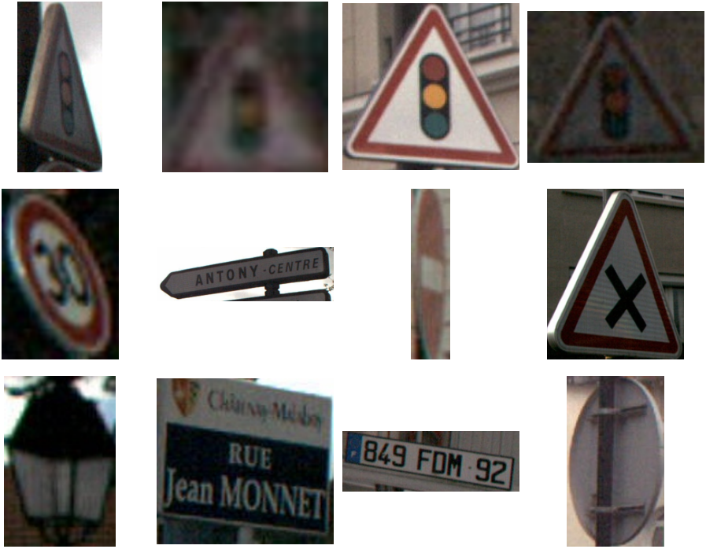

## FTSC
The official French Traffic Sign Classification dataset.

  

# Description
This dataset contains 2D pictures of french traffic signs with accurate labels from the french traffic sign catalogue. It has been gathered for the most part in the city of Antony, France, in various weathers and at daytime. The dataset may be update later with new content.

| Feature       | Value         |
| ------------- | ------------- |
| # Samples     | 10959         |
| # Classes     | 91            |
| Location      | Antony, France|
| Weather       | Good, light rain |
| Time          | Daytime       |

# Images
The images are crops of traffic signs observed from 2D RGB cameras mounted on a vehicle. They vary in resolution from 14*15px to up to 888*826px, which means some images are blurrier than others, which may constitute an advantage for models to learn in tough conditions. Some of the images are cropped because the signs might have been occluded, but this is only accepted when the label can still be determined visually by humans. The signs are not always tightly cropped, but they are always the biggest object in the image.

# Labels
The labelling has been made manually mainly following the French Traffic sign catalogue with some arbitrary modifications.
We follow the category and superclass system introducted by [GTSRB](https://arxiv.org/abs/2003.03256) and re-used by [ETSD](https://citlag.github.io/publication/etsd/) but add two category ("others" and "NIC" (NotInCatalogue)) and other superclasses.

Given the restrained location of acquisition of the images, we did not observe all the classes of French traffic signs, of which there are about 300. We only label the signs we were able to observe and tweak some of the classes that we deem irrelevant for the model to learn. We provide a csv file "classes.csv" and a catalogue folder with examples to illustrate the exact labels we are using, as well as csv files to convert our classes to the ones used by the ETSD dataset and conversely.

New classes that we added :

# How to use

The dataset can be downloaded directly.
We provide python scripts to easily manipulate the data, including to go from and to our category, superclasses and classes system to raw images depending on your use case, as well as to convert the labels to another dataset format (ETSD format at the moment).

# LICENSE

This project is released under the [Apache 2.0 license](http://www.apache.org/licenses).

# Institutions

  
  
  

